<div align="center">



# Pi Manager

### [Pi Coding Agent](https://github.com/badlogic/pi-mono) 的本地 Web 控制台

模型 · 子代理 · 运行态 · 用量 · 会话 · 识图 · 工作区  
零 npm 依赖 · 打开 `localhost:3001` 即可

<br/>

[](https://nodejs.org/)
[](./package.json)
[](http://localhost:3001)
[](./LICENSE)

<br/>

```bash
git clone https://github.com/scp3500/pi-manager.git
cd pi-manager && npm start
# → http://localhost:3001
```

<sub>Windows 可双击 `start.bat`（默认后台，日志在 `logs/`）</sub>

</div>

---

## 为什么用

<table>
<tr>
<td width="33%" valign="top">

### 一屏掌控
默认模型、今日费用、缓存命中、会话体积、临时清理，总览页一次看完。

</td>
<td width="33%" valign="top">

### 运行态可见
从 session jsonl 推断任务进度、工具调用、并行/串行与子代理状态。

</td>
<td width="33%" valign="top">

### 可选扩展
自研 OpenVL 识图、记忆/知识库、Pi 插件均可缺失；缺什么不拖垮核心页。

</td>
</tr>
</table>

---

## 功能

| 模块 | 说明 |
|:--|:--|
| **总览** | 默认模型直达、用量 KPI、健康检查、配置导出 |
| **运行** | 在干活 / 在想 / 已退出；进程探测减少假运行 |
| **模型** | 供应商 CRUD、远程拉模型、默认 Provider/Model |
| **子代理** | 编辑 `agents/*.md`、工具权限预设、工作流规范 |
| **用量** | token / 费用趋势；与状态栏同一套 `usage.cost.total` |
| **会话** | 搜索、清理、回收站还原 |
| **识图** | 集成自研 [OpenVL](https://github.com/scp3500/openvl)；教程页可一键安装 |
| **插件** | packages / extensions 列表 + 白名单安装 |
| **工作区** | 映射 memory / knowledge 到本机目录 |
| **教程** | 应用内安装说明、外链、示例 agent |
| **内嵌助手** | 控制台侧栏聊天；写操作需确认 |

---

## 架构

```text
                 ┌──────────────────────────┐
                 │     Pi Manager :3001     │
                 │  Node http + static UI   │
                 └────────────┬─────────────┘
                              │ 读写 / 扫描
           ┌──────────────────┼──────────────────┐
           ▼                  ▼                  ▼
   ~/.pi/agent/*         工作区映射         OpenVL（自研，可选）
   models settings       memory/knowledge   @scp3500/openvl
   agents sessions       pi-manager.json    profiles + CLI
```

| 组件 | 角色 |
|------|------|
| **[Pi](https://github.com/badlogic/pi-mono)** | 数据面：配置与会话在 `~/.pi/agent` |
| **Node ≥ 18** | 运行面：本仓库 **0** 个 production npm 依赖 |
| **[OpenVL](https://github.com/scp3500/openvl)**（同作者） | 可选识图能力；Manager 管理其配置，教程页可一键安装 |
| **工作区** | 可选内容根 |

---

## 快速开始

<details open>
<summary><b>1. Pi 配置目录</b></summary>

<br/>

```text
~/.pi/agent/
├── models.json
├── settings.json
├── agents/
└── sessions/
```

Windows：`%USERPROFILE%\.pi\agent\`

</details>

<details open>
<summary><b>2. 启动控制台</b></summary>

<br/>

```bash
git clone https://github.com/scp3500/pi-manager.git
cd pi-manager
npm start
```

| 动作 | 方式 |
|------|------|
| 打开 | http://localhost:3001 |
| 后台 | `start.bat` |
| 停止 | `stop.bat` |

</details>

<details>
<summary><b>3. 可选：OpenVL 识图（同作者）</b></summary>

<br/>

[OpenVL](https://github.com/scp3500/openvl) 是我写的本机视觉 CLI / Skill。Pi Manager 负责管理它的 profiles 与连通测试。

```bash
npm install -g @scp3500/openvl
```

或：**更多 → 教程 → 识图 → 一键安装**。

</details>

<details>
<summary><b>4. 可选：记忆 / 知识库</b></summary>

<br/>

1. **工作区** → 添加本机根目录  
2. 映射示例：

```json
{
  "memory": "memory",
  "knowledge": "knowledge"
}
```

3. 打开「记忆 / 知识库」  

详见应用内 **更多 → 教程**。

</details>

---

## 环境变量

| 变量 | 默认 | 含义 |
|------|------|------|
| `PORT` | `3001` | 服务端口 |
| `PI_AGENT_DIR` | `~/.pi/agent` | Pi 配置根 |
| `PI_MANAGER_CONFIG` | `$PI_AGENT_DIR/pi-manager.json` | 控制台配置 |
| `OPENVL_PKG_DIR` | 自动探测 | OpenVL 包目录 |

---

## 安全

> [!IMPORTANT]
> 默认服务本机。**不要把端口裸暴露到公网。**

- 导出 JSON 会脱敏 API Key  
- 写操作修改真实 Pi 配置（滚动 `.bak`）  
- 教程一键安装仅白名单：  
  - `npm install -g @scp3500/openvl`  
  - `pi install npm:…`  
  - 创建本地示例子代理文件  
- 第三方 Pi 包拥有完整本机权限，装前请审来源  

---

## 目录

```text
pi-manager/
├── server.js
├── lib/
├── public/           # 静态前端，无构建
├── start.bat
├── stop.bat
├── docs/assets/      # README 图
└── test/
```

```bash
npm start
npm test
```

静态资源硬刷新；改 `server.js` / `lib/*` 需重启。

---

## 限制

| 点 | 说明 |
|----|------|
| 运行页 | jsonl 推断 + 进程探测；多窗口 PID↔session 难精确 |
| 用量 | 首次全量扫描可能慢，之后有缓存 |
| 内嵌助手 | 与 Pi 主 session 隔离，不进 sessions 用量文件 |

---

## 相关项目

| 项目 | 关系 |
|------|------|
| **[OpenVL](https://github.com/scp3500/openvl)** | **同作者**。本机看图 CLI / Skill；Manager 的识图页管理其配置与一键安装 |
| **[Pi Coding Agent](https://github.com/badlogic/pi-mono)** | 上游 Agent 运行时；Manager 读写其 `~/.pi/agent` 配置与会话 |

用量统计思路参考社区 session 工具（见 `lib/usage.js` 头注释）。

## 友链 / 社区认可

本项目**完整开源**，并**链接认可** [LINUX DO](https://linux.do) 社区：

- 官网 / 社区：[https://linux.do](https://linux.do)
- 感谢 LINUX DO 佬友与开源氛围

[](https://linux.do)

---

<div align="center">

**[OpenVL](https://github.com/scp3500/openvl)** · **[LINUX DO](https://linux.do)** · **[MIT License](./LICENSE)**

<sub>Built for people who live in the terminal — and still want a dashboard.</sub>

</div>
