<div align="center">



# Pi Manager

### 给 [Pi Coding Agent](https://github.com/badlogic/pi-mono) 的本地 Web 控制台

**模型 · 子代理 · 运行态 · 用量 · 会话 · 识图 · 工作区**  
零 npm 依赖 · 开箱即用 · `localhost:3001`

<br/>

[](https://nodejs.org/)
[](./package.json)
[](http://localhost:3001)
[](./LICENSE)

<br/>

```bash
git clone https://github.com/scp3500/pi-manager.git
cd pi-manager && npm start
# → http://localhost:3001
```

<sub>Windows 也可双击 `start.bat`（默认后台运行，日志在 `logs/`）</sub>

</div>

---

## ✨ 为什么用它

<table>
<tr>
<td width="33%" valign="top">

### 🖥️ 一屏掌控
默认模型、今日费用、缓存命中、会话体积、临时文件清理——总览页一次看完。

</td>
<td width="33%" valign="top">

### ⚡ 实时运行态
从 session jsonl 推断任务进度、工具调用、并行/串行与子代理状态。

</td>
<td width="33%" valign="top">

### 🧩 可降级扩展
OpenVL 识图、记忆/知识库、Pi 插件都是可选；缺什么不拖垮核心页。

</td>
</tr>
</table>

---

## 🧭 功能全景

| | 模块 | 你能做什么 |
|:--:|:--|:--|
| 📊 | **总览** | 默认模型直达管理、用量 KPI、健康检查、配置导出 |
| 🟢 | **运行** | 在干活 / 在想 / 已退出 · 进程探测防假运行 |
| 🧠 | **模型** | 供应商 CRUD、远程拉模型、默认 Provider/Model |
| 🤖 | **子代理** | `agents/*.md` 编辑、工具权限预设、工作流规范 |
| 💸 | **用量** | token / 费用趋势，与状态栏同一套 `cost.total` 口径 |
| 💬 | **会话** | 搜索、按天清理、回收站还原 |
| 👁️ | **识图** | [OpenVL](https://github.com/scp3500/openvl) profiles · 一键安装 |
| 📦 | **插件** | packages / extensions 列表 + 教程页白名单安装 |
| 🗺️ | **工作区** | 映射 memory / knowledge 到本机任意目录 |
| 📖 | **教程** | 应用内安装说明、外链、一键创建示例 agent |
| 🪄 | **内嵌助手** | 控制台侧栏聊天 · 写操作二次确认 |

---

## 🏗 架构

```text
                 ┌──────────────────────────┐
                 │     Pi Manager :3001     │
                 │  Node http + static UI   │
                 └────────────┬─────────────┘
                              │ 读写 / 扫描
           ┌──────────────────┼──────────────────┐
           ▼                  ▼                  ▼
   ~/.pi/agent/*        工作区映射目录      OpenVL（可选）
   models settings      memory / knowledge  @scp3500/openvl
   agents sessions      via pi-manager.json  profiles + CLI
```

| 依赖 | 角色 |
|------|------|
| **[Pi](https://github.com/badlogic/pi-mono)** | 数据面——配置与会话都在 `~/.pi/agent` |
| **Node ≥ 18** | 运行面——本仓库 **0** 个 npm production 依赖 |
| **[OpenVL](https://github.com/scp3500/openvl)** | 可选识图；教程页可一键 `npm i -g` |
| **工作区** | 可选内容根；不配也能用模型/子代理/用量 |

---

## 🚀 快速开始

<details open>
<summary><b>① 先有 Pi 配置目录</b></summary>

<br/>

```text
~/.pi/agent/
├── models.json
├── settings.json
├── agents/
└── sessions/
```

Windows：`%USERPROFILE%\.pi\agent\`

</details>

<details open>
<summary><b>② 启动控制台</b></summary>

<br/>

```bash
git clone https://github.com/scp3500/pi-manager.git
cd pi-manager
npm start
```

| 动作 | 方式 |
|------|------|
| 打开 | http://localhost:3001 |
| 后台启动 | `start.bat` |
| 停止 | `stop.bat` |

</details>

<details>
<summary><b>③ 可选：OpenVL 识图</b></summary>

<br/>

```bash
npm install -g @scp3500/openvl
```

或打开控制台 **更多 → 教程 → 识图 → 一键安装**。

</details>

<details>
<summary><b>④ 可选：记忆 / 知识库映射</b></summary>

<br/>

1. 进入 **工作区** → 添加本机根目录  
2. 映射示例：

```json
{
  "memory": "memory",
  "knowledge": "knowledge"
}
```

3. 打开「记忆 / 知识库」页  

更多说明：**更多 → 教程**。

</details>

---

## 🎛 环境变量

| 变量 | 默认 | 说明 |
|------|------|------|
| `PORT` | `3001` | 服务端口 |
| `PI_AGENT_DIR` | `~/.pi/agent` | Pi 配置根 |
| `PI_MANAGER_CONFIG` | `$PI_AGENT_DIR/pi-manager.json` | 控制台自身配置 |
| `OPENVL_PKG_DIR` | 自动探测 | OpenVL 包目录 |

---

## 🔒 安全要点

> [!IMPORTANT]
> 本控制台默认服务本机。**不要把端口裸暴露到公网。**

- 导出 JSON 会脱敏 API Key  
- 写操作修改真实 Pi 配置（带滚动 `.bak`）  
- 教程「一键安装」仅白名单命令：  
  - `npm install -g @scp3500/openvl`  
  - `pi install npm:…`  
  - 创建本地示例子代理文件  
- 第三方 Pi 包拥有完整本机权限——装前看源码  

---

## 📁 仓库结构

```text
pi-manager/
├── server.js            # HTTP + /api/*
├── lib/                 # 业务：models / usage / runtime / install …
├── public/              # 静态前端（hash 路由，无构建）
├── start.bat / stop.bat
├── docs/
│   ├── assets/          # README 视觉资源
│   ├── DEVELOPMENT.md   # API · 路由 · 约束
│   └── UI.md
└── test/
```

```bash
npm start    # 启动
npm test     # node --test
```

静态资源 Ctrl+F5；改 `server.js` / `lib/*` 需重启。

---

## 📌 已知限制

| 点 | 说明 |
|----|------|
| 运行页 | jsonl 推断 + 进程探测；多窗口难精确 PID↔session |
| 用量 | 首次全量扫 sessions 可能慢，之后磁盘/内存缓存 |
| 内嵌助手 | 与 Pi 主 session 隔离，不进 sessions 用量文件 |

---

## 🙏 致谢

- [Pi Coding Agent](https://github.com/badlogic/pi-mono)  
- [OpenVL](https://github.com/scp3500/openvl)  
- 用量解析参考社区 session 统计工具（见 `lib/usage.js` 头注释）

---

<div align="center">

**[文档](./docs/DEVELOPMENT.md)** · **[OpenVL](https://github.com/scp3500/openvl)** · **[MIT License](./LICENSE)**

<sub>Built for people who live in the terminal — and still want a dashboard.</sub>

</div>
